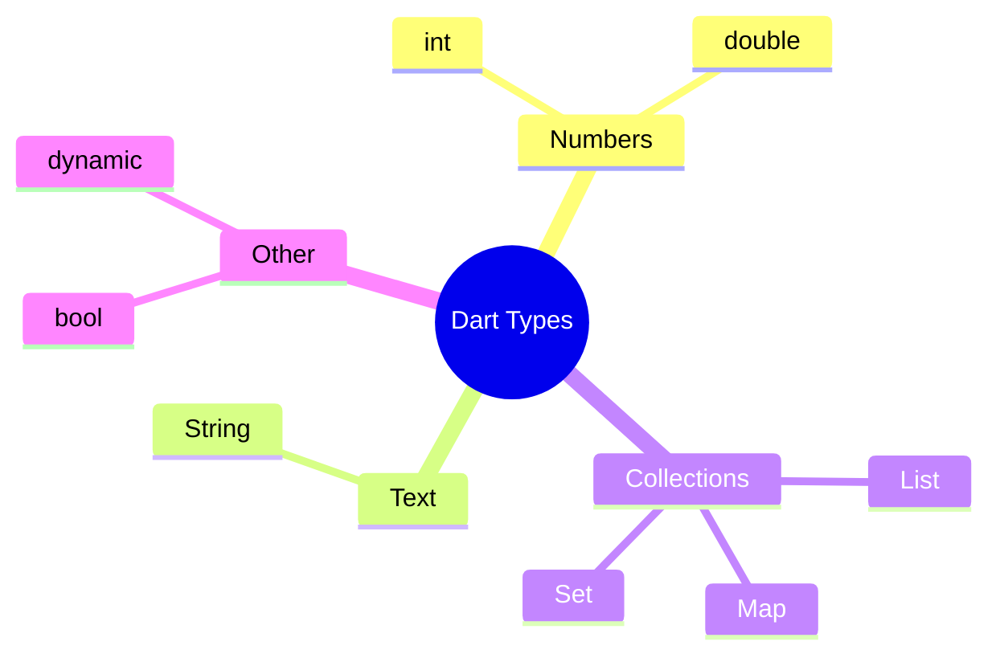
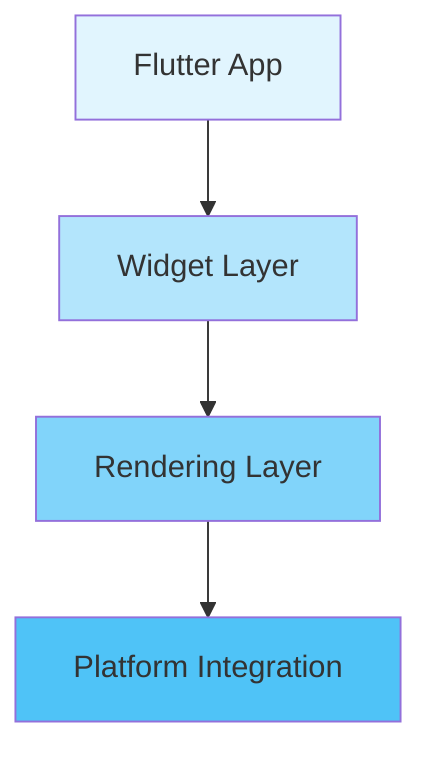
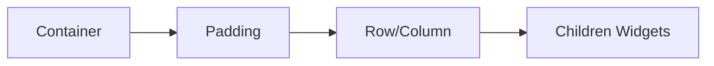
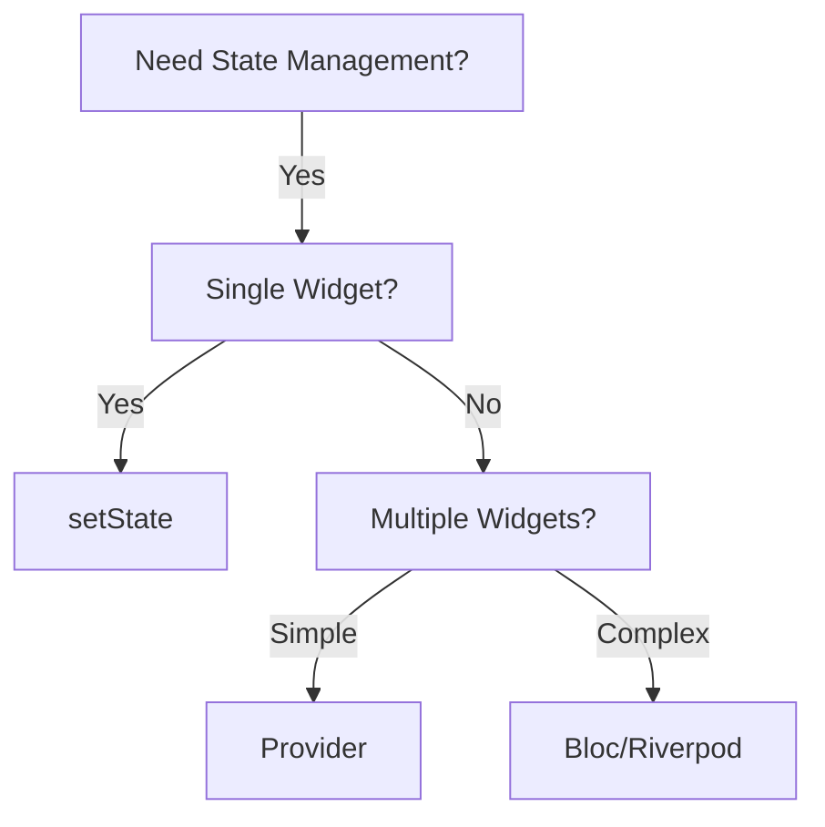
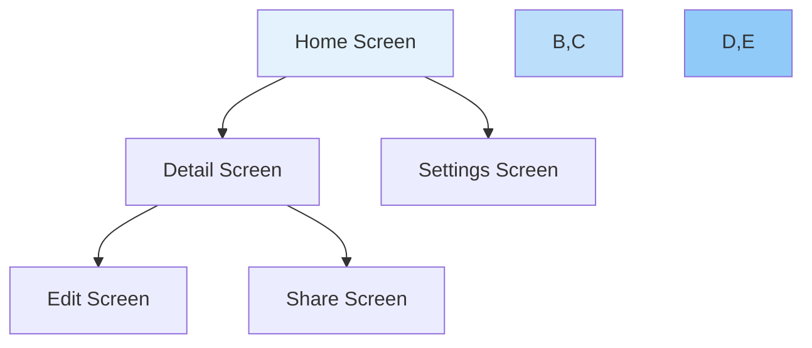
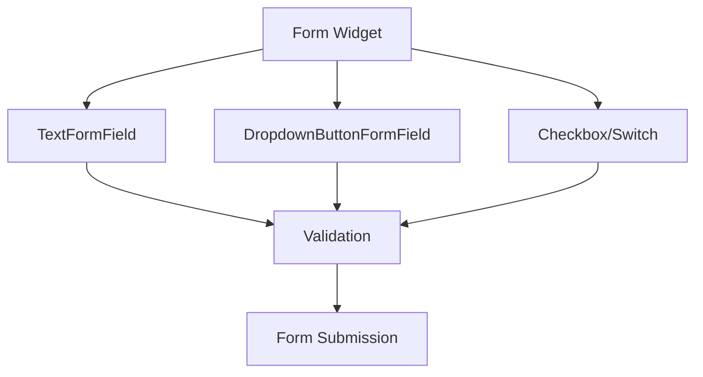
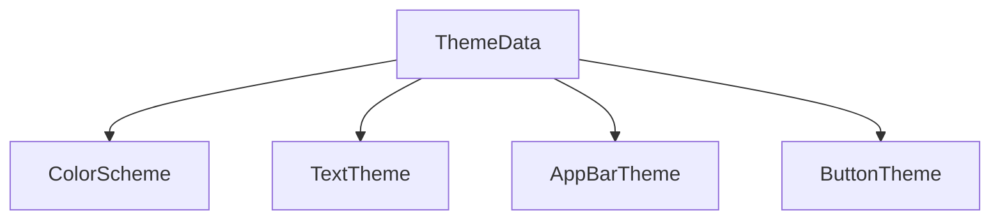
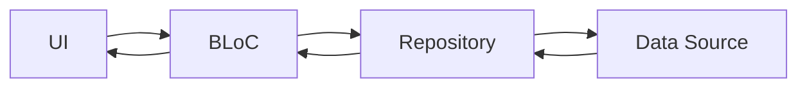

# Flutter Development: The Complete Guide

## Table of Contents
1. [Dart Programming Basics](#dart-basics)
2. [Flutter Framework Overview](#flutter-overview)
3. [Widget System](#widget-system)
4. [State Management](#state-management)

## Dart Basics

### Core Data Types


### Variables & Constants
| Type | Example | Usage |
|------|---------|-------|
| var | `var name = 'John'` | Type inference |
| final | `final age = 30` | Runtime constant |
| const | `const pi = 3.14` | Compile-time constant |

### Code Examples

```dart
// Variable declarations
String name = 'Alice';
int age = 25;
final DateTime now = DateTime.now();
const double pi = 3.14159;

// Basic operations
int sum = 5 + 3;
String greeting = 'Hello $name'; // String interpolation
```

## Flutter Overview

### Architecture


### Project Structure
```
📦 flutter_app
 ┣ 📂 lib
 ┃ ┗ 📜 main.dart
 ┣ 📂 assets
 ┣ 📂 test
 ┣ 📜 pubspec.yaml
 ┗ 📜 README.md
```

## Widget System

### Types of Widgets

#### 1. Stateless Widgets
- Immutable
- No internal state
- Pure functions of their properties
- Example: Icons, Text, RaisedButton

```dart
class WelcomeText extends StatelessWidget {
  final String name;
  WelcomeText(this.name);

  @override
  Widget build(BuildContext context) {
    return Text('Welcome, $name!');
  }
}
```

#### 2. Stateful Widgets
- Mutable state
- Can be updated during lifetime
- Maintains state between rebuilds

```dart
class Counter extends StatefulWidget {
  @override
  _CounterState createState() => _CounterState();
}

class _CounterState extends State<Counter> {
  int count = 0;
  
  void increment() {
    setState(() {
      count++;
    });
  }

  @override
  Widget build(BuildContext context) {
    return Text('Count: $count');
  }
}
```

### Layout Widgets


#### Common Layouts
1. **Container**
   - Single child
   - Padding, margins, decoration
   ```dart
   Container(
     padding: EdgeInsets.all(8.0),
     margin: EdgeInsets.symmetric(vertical: 16.0),
     decoration: BoxDecoration(
       color: Colors.blue,
       borderRadius: BorderRadius.circular(8.0),
     ),
     child: Text('Hello'),
   )
   ```

2. **Row/Column**
   - Multiple children
   - Linear layout
   ```dart
   Row(
     mainAxisAlignment: MainAxisAlignment.spaceEvenly,
     children: [
       Icon(Icons.star),
       Icon(Icons.star),
       Icon(Icons.star),
     ],
   )
   ```

## State Management

### Local State
- Using `setState()`
- Scoped to single widget
- Simple to implement

### Global State
Options include:
1. **Provider**
   ```dart
   ChangeNotifierProvider(
     create: (context) => MyState(),
     child: MyApp(),
   )
   ```

2. **Bloc**
   ```dart
   BlocProvider(
     create: (context) => MyBloc(),
     child: MyApp(),
   )
   ```

3. **Riverpod**
   ```dart
   final counterProvider = StateProvider((ref) => 0);
   ```

### State Management Decision Tree


## Best Practices

### Widget Structure
- Keep widgets small and focused
- Extract reusable widgets
- Use const constructors when possible

### Performance
- Minimize rebuilds
- Use appropriate state management
- Profile regularly

### Code Organization
```
lib/
├── screens/
├── widgets/
├── models/
├── services/
└── utils/
```

---

# Flutter Development Guide (Continued)

## Navigation & Routing

### Navigation Patterns


### Types of Navigation

#### 1. Basic Navigation
```dart
// Push new screen
Navigator.push(
  context,
  MaterialPageRoute(builder: (context) => DetailScreen()),
);

// Pop back
Navigator.pop(context);
```

#### 2. Named Routes
```yaml
# In MaterialApp
MaterialApp(
  routes: {
    '/': (context) => HomeScreen(),
    '/details': (context) => DetailScreen(),
    '/settings': (context) => SettingsScreen(),
  },
)
```

#### 3. Navigation with Arguments
```dart
// Passing Data
class DetailScreen extends StatelessWidget {
  final String data;
  DetailScreen({required this.data});
  
  // Build method...
}

// Navigate with data
Navigator.push(
  context,
  MaterialPageRoute(
    builder: (context) => DetailScreen(data: 'Hello!'),
  ),
);
```

## Forms & Input Handling

### Form Structure


### Form Implementation
```dart
class MyCustomForm extends StatefulWidget {
  @override
  _MyCustomFormState createState() => _MyCustomFormState();
}

class _MyCustomFormState extends State {
  final _formKey = GlobalKey();
  String _email = '';
  String _password = '';

  @override
  Widget build(BuildContext context) {
    return Form(
      key: _formKey,
      child: Column(
        children: [
          TextFormField(
            decoration: InputDecoration(labelText: 'Email'),
            validator: (value) {
              if (value?.isEmpty ?? true) {
                return 'Please enter email';
              }
              return null;
            },
            onSaved: (value) => _email = value ?? '',
          ),
          // More form fields...
        ],
      ),
    );
  }
}
```

## Animations

### Types of Animations
1. **Implicit Animations**
2. **Explicit Animations**
3. **Hero Animations**
4. **Custom Animations**

### Animation Examples

#### 1. Implicit Animation
```dart
AnimatedContainer(
  duration: Duration(milliseconds: 300),
  width: _isExpanded ? 200.0 : 100.0,
  height: _isExpanded ? 200.0 : 100.0,
  color: _isExpanded ? Colors.blue : Colors.red,
  child: Center(child: Text('Tap to animate')),
)
```

#### 2. Custom Animation
```dart
class AnimatedLogo extends StatefulWidget {
  @override
  _AnimatedLogoState createState() => _AnimatedLogoState();
}

class _AnimatedLogoState extends State
    with SingleTickerProviderStateMixin {
  late AnimationController _controller;
  late Animation _animation;

  @override
  void initState() {
    super.initState();
    _controller = AnimationController(
      duration: const Duration(seconds: 2),
      vsync: this,
    );
    _animation = CurvedAnimation(
      parent: _controller,
      curve: Curves.easeIn,
    );
  }
  
  // Widget build method...
}
```

## Theming & Styling

### Theme Structure


### Theme Implementation
```dart
MaterialApp(
  theme: ThemeData(
    primarySwatch: Colors.blue,
    brightness: Brightness.light,
    textTheme: TextTheme(
      headline1: TextStyle(
        fontSize: 24,
        fontWeight: FontWeight.bold,
      ),
      bodyText1: TextStyle(
        fontSize: 16,
        height: 1.5,
      ),
    ),
    // More theme data...
  ),
  // App content...
)
```

## Advanced Widgets

### CustomPaint
```dart
class MyCustomPainter extends CustomPainter {
  @override
  void paint(Canvas canvas, Size size) {
    final paint = Paint()
      ..color = Colors.blue
      ..strokeWidth = 4
      ..style = PaintingStyle.stroke;

    canvas.drawCircle(
      Offset(size.width / 2, size.height / 2),
      100,
      paint,
    );
  }

  @override
  bool shouldRepaint(CustomPainter oldDelegate) => false;
}
```

### Gestures
```dart
GestureDetector(
  onTapDown: (details) {
    // Handle tap down
  },
  onPanUpdate: (details) {
    // Handle drag
  },
  child: Container(
    width: 200,
    height: 200,
    color: Colors.amber,
  ),
)
```

## State Management Patterns

### BLoC Pattern Implementation


### Example BLoC Implementation
```dart
// Event
abstract class CounterEvent {}
class IncrementEvent extends CounterEvent {}

// State
class CounterState {
  final int count;
  CounterState(this.count);
}

// BLoC
class CounterBloc extends Bloc {
  CounterBloc() : super(CounterState(0)) {
    on((event, emit) {
      emit(CounterState(state.count + 1));
    });
  }
}
```

## Testing

### Types of Tests
1. **Unit Tests**
2. **Widget Tests**
3. **Integration Tests**

### Example Tests
```dart
// Widget Test
testWidgets('Counter increments smoke test', (WidgetTester tester) async {
  await tester.pumpWidget(MyApp());
  expect(find.text('0'), findsOneWidget);
  await tester.tap(find.byIcon(Icons.add));
  await tester.pump();
  expect(find.text('1'), findsOneWidget);
});

// Unit Test
test('Counter value should be incremented', () {
  final counter = Counter();
  counter.increment();
  expect(counter.value, 1);
});
```
